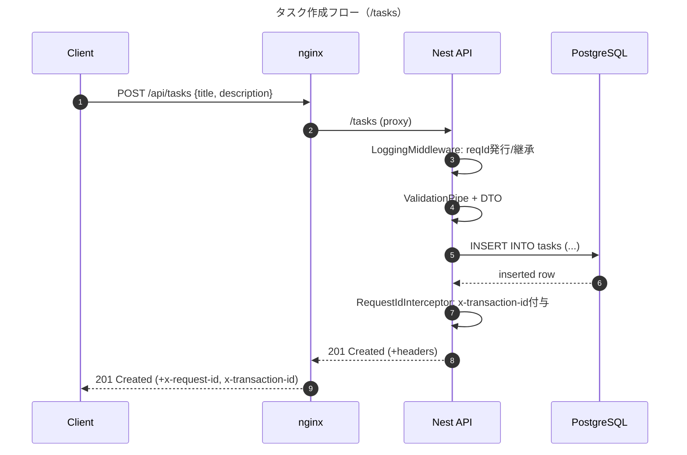

# NestJS Weekend Mini API – Starter Kit
最小の「タスク管理API」を題材に、以下を5–6時間で実装しながら学びます。

- シーケンス図（mermaid）
- API I/O（DTO/バリデーション）
- Swagger（OpenAPI）自動生成
- ログ & トランザクションID（ミドルウェア＋インターセプタ）
- nginx リバースプロキシ
- TypeORM（PostgreSQL）
- Docker & healthcheck

---

## 0. 目標ファイル構成
```
mini-api/
├─ docker-compose.yml
├─ nginx/
│  └─ default.conf
├─ api/
│  ├─ Dockerfile
│  ├─ package.json
│  ├─ tsconfig.json
│  ├─ src/
│  │  ├─ main.ts
│  │  ├─ app.module.ts
│  │  ├─ common/
│  │  │  ├─ logging.middleware.ts
│  │  │  ├─ request-id.interceptor.ts
│  │  │  └─ swagger.ts
│  │  └─ tasks/
│  │     ├─ tasks.module.ts
│  │     ├─ tasks.controller.ts
│  │     ├─ tasks.service.ts
│  │     ├─ dto/
│  │     │  ├─ create-task.dto.ts
│  │     │  └─ get-tasks.dto.ts
│  │     └─ entities/
│  │        └─ task.entity.ts
│  └─ ormconfig.ts
└─ postgres/
   └─ init/01_init.sql
```

---

## 1. docker-compose.yml
PostgreSQL・API・nginxの3つを起動。healthcheckを追加し、依存順序を安定化。

```yaml
a version: '3.9'
services:
  postgres:
    image: postgres:16
    container_name: miniapi_postgres
    environment:
      POSTGRES_USER: appuser
      POSTGRES_PASSWORD: apppass
      POSTGRES_DB: appdb
    ports:
      - "5432:5432"
    volumes:
      - pg_data:/var/lib/postgresql/data
      - ./postgres/init:/docker-entrypoint-initdb.d:ro
    healthcheck:
      test: ["CMD-SHELL", "pg_isready -U appuser -d appdb"]
      interval: 5s
      timeout: 3s
      retries: 10

  api:
    build: ./api
    container_name: miniapi_api
    environment:
      DATABASE_HOST: postgres
      DATABASE_PORT: 5432
      DATABASE_USER: appuser
      DATABASE_PASSWORD: apppass
      DATABASE_NAME: appdb
      NODE_ENV: development
      PORT: 3000
    depends_on:
      postgres:
        condition: service_healthy
    ports:
      - "3000:3000"

  nginx:
    image: nginx:1.27-alpine
    container_name: miniapi_nginx
    volumes:
      - ./nginx/default.conf:/etc/nginx/conf.d/default.conf:ro
    ports:
      - "80:80"
    depends_on:
      - api

volumes:
  pg_data:
```

---

## 2. nginx/default.conf
`/api` を NestJS にプロキシ。簡易CORS/ヘッダも付与。

```nginx
server {
  listen 80;
  server_name _;

  location /healthz {
    return 200 "ok";
    add_header Content-Type text/plain;
  }

  location /api/ {
    proxy_pass http://api:3000/;
    proxy_set_header Host $host;
    proxy_set_header X-Real-IP $remote_addr;
    proxy_set_header X-Forwarded-For $proxy_add_x_forwarded_for;
    proxy_set_header X-Forwarded-Proto $scheme;
  }

  # Swagger UI (Nest の /api-docs へ)
  location /docs {
    proxy_pass http://api:3000/api-docs;
  }
}
```

---

## 3. api/Dockerfile
Nest をビルドして実行。開発中はホットリロードでもOK（ここではビルド実行）。

```dockerfile
FROM node:20-alpine AS deps
WORKDIR /app
COPY package*.json ./
RUN npm ci

FROM node:20-alpine AS build
WORKDIR /app
COPY --from=deps /app/node_modules ./node_modules
COPY . .
RUN npm run build

FROM node:20-alpine AS runner
WORKDIR /app
ENV NODE_ENV=production
COPY --from=build /app/node_modules ./node_modules
COPY --from=build /app/dist ./dist
CMD ["node", "dist/src/main.js"]
```

---

## 4. api/package.json
必要最低限の依存関係（TypeORM v0.3系）。

```json
{
  "name": "mini-api",
  "version": "1.0.0",
  "scripts": {
    "start": "nest start",
    "start:dev": "nest start --watch",
    "build": "nest build"
  },
  "dependencies": {
    "@nestjs/common": "^10.0.0",
    "@nestjs/core": "^10.0.0",
    "@nestjs/platform-express": "^10.0.0",
    "@nestjs/swagger": "^7.4.0",
    "class-transformer": "^0.5.1",
    "class-validator": "^0.14.0",
    "reflect-metadata": "^0.1.13",
    "rxjs": "^7.8.1",
    "swagger-ui-express": "^5.0.0",
    "typeorm": "^0.3.20",
    "pg": "^8.11.5"
  },
  "devDependencies": {
    "@nestjs/cli": "^10.3.0",
    "@nestjs/schematics": "^10.0.0",
    "@nestjs/testing": "^10.0.0",
    "@types/express": "^4.17.21",
    "@types/node": "^20.11.30",
    "ts-node": "^10.9.2",
    "typescript": "^5.4.0"
  }
}
```

---

## 5. api/tsconfig.json
```json
{
  "compilerOptions": {
    "module": "commonjs",
    "declaration": false,
    "removeComments": true,
    "emitDecoratorMetadata": true,
    "experimentalDecorators": true,
    "allowSyntheticDefaultImports": true,
    "target": "es2018",
    "sourceMap": true,
    "outDir": "./dist",
    "baseUrl": "./",
    "strict": true,
    "esModuleInterop": true
  },
  "include": ["src"]
}
```

---

## 6. api/src/common/swagger.ts
Swagger のセットアップ（/api-docs）。

```ts
import { INestApplication } from '@nestjs/common';
import { DocumentBuilder, SwaggerModule } from '@nestjs/swagger';

export function setupSwagger(app: INestApplication) {
  const config = new DocumentBuilder()
    .setTitle('Mini Tasks API')
    .setDescription('Simple task API for weekend practice')
    .setVersion('1.0.0')
    .addBearerAuth()
    .build();
  const doc = SwaggerModule.createDocument(app, config);
  SwaggerModule.setup('api-docs', app, doc);
}
```

---

## 7. api/src/common/logging.middleware.ts
リクエストごとにUUIDv4を生成し、ログへ。`X-Request-Id` が既にある場合は継承。

```ts
import { Injectable, NestMiddleware } from '@nestjs/common';
import { Request, Response, NextFunction } from 'express';
import { randomUUID } from 'crypto';

@Injectable()
export class LoggingMiddleware implements NestMiddleware {
  use(req: Request, res: Response, next: NextFunction) {
    const incoming = req.header('x-request-id');
    const reqId = incoming || randomUUID();
    (req as any).reqId = reqId;

    const start = Date.now();
    console.log(`[REQ] ${req.method} ${req.originalUrl} id=${reqId}`);

    res.on('finish', () => {
      const ms = Date.now() - start;
      console.log(`[RES] ${req.method} ${req.originalUrl} id=${reqId} status=${res.statusCode} ${ms}ms`);
    });

    res.setHeader('x-request-id', reqId);
    next();
  }
}
```

---

## 8. api/src/common/request-id.interceptor.ts
レスポンスにも `x-transaction-id`（= reqId）を付与。

```ts
import { CallHandler, ExecutionContext, Injectable, NestInterceptor } from '@nestjs/common';
import { Observable } from 'rxjs';
import { tap } from 'rxjs/operators';

@Injectable()
export class RequestIdInterceptor implements NestInterceptor {
  intercept(context: ExecutionContext, next: CallHandler): Observable<any> {
    const ctx = context.switchToHttp();
    const req = ctx.getRequest<Request & { reqId?: string }>();
    const res = ctx.getResponse();
    return next.handle().pipe(
      tap(() => {
        if ((req as any).reqId) {
          res.setHeader('x-transaction-id', (req as any).reqId);
        }
      })
    );
  }
}
```

---

## 9. api/src/app.module.ts
ミドルウェアを適用し、TasksModule を読み込む。

```ts
import { MiddlewareConsumer, Module, NestModule } from '@nestjs/common';
import { TypeOrmModule } from '@nestjs/typeorm';
import { TasksModule } from './tasks/tasks.module';
import { LoggingMiddleware } from './common/logging.middleware';
import { Task } from './tasks/entities/task.entity';

@Module({
  imports: [
    TypeOrmModule.forRoot({
      type: 'postgres',
      host: process.env.DATABASE_HOST,
      port: Number(process.env.DATABASE_PORT || 5432),
      username: process.env.DATABASE_USER,
      password: process.env.DATABASE_PASSWORD,
      database: process.env.DATABASE_NAME,
      entities: [Task],
      synchronize: true, // 学習用。実運用ではfalse + migration
    }),
    TasksModule,
  ],
})
export class AppModule implements NestModule {
  configure(consumer: MiddlewareConsumer) {
    consumer.apply(LoggingMiddleware).forRoutes('*');
  }
}
```

---

## 10. api/src/main.ts
バリデーション有効化、Swagger、有用ヘッダの設定、インターセプタ適用。

```ts
import { ValidationPipe } from '@nestjs/common';
import { NestFactory } from '@nestjs/core';
import { AppModule } from './app.module';
import { setupSwagger } from './common/swagger';
import { RequestIdInterceptor } from './common/request-id.interceptor';

async function bootstrap() {
  const app = await NestFactory.create(AppModule, { cors: true });
  app.useGlobalPipes(new ValidationPipe({ whitelist: true, transform: true }));
  app.useGlobalInterceptors(new RequestIdInterceptor());
  setupSwagger(app);

  const port = process.env.PORT || 3000;
  await app.listen(port);
  console.log(`API listening on port ${port}`);
}
bootstrap();
```

---

## 11. api/src/tasks/entities/task.entity.ts

```ts
import { Column, CreateDateColumn, Entity, PrimaryGeneratedColumn, UpdateDateColumn } from 'typeorm';

@Entity('tasks')
export class Task {
  @PrimaryGeneratedColumn('increment')
  id!: number;

  @Column({ type: 'varchar', length: 200 })
  title!: string;

  @Column({ type: 'text', nullable: true })
  description?: string;

  @Column({ type: 'boolean', default: false })
  done!: boolean;

  @CreateDateColumn()
  createdAt!: Date;

  @UpdateDateColumn()
  updatedAt!: Date;
}
```

---

## 12. api/src/tasks/dto/create-task.dto.ts

```ts
import { ApiProperty } from '@nestjs/swagger';
import { IsBoolean, IsOptional, IsString, MaxLength } from 'class-validator';

export class CreateTaskDto {
  @ApiProperty({ example: 'Write sequence diagram' })
  @IsString()
  @MaxLength(200)
  title!: string;

  @ApiProperty({ example: 'Draw mermaid sequence for API flow', required: false })
  @IsOptional()
  @IsString()
  description?: string;

  @ApiProperty({ example: false, required: false })
  @IsOptional()
  @IsBoolean()
  done?: boolean;
}
```

---

## 13. api/src/tasks/dto/get-tasks.dto.ts
簡易フィルタ（`done`）。

```ts
import { ApiPropertyOptional } from '@nestjs/swagger';
import { IsBooleanString, IsOptional } from 'class-validator';

export class GetTasksDto {
  @ApiPropertyOptional({ description: 'true or false' })
  @IsOptional()
  @IsBooleanString()
  done?: string; // 'true' | 'false'
}
```

---

## 14. api/src/tasks/tasks.service.ts

```ts
import { Injectable } from '@nestjs/common';
import { InjectRepository } from '@nestjs/typeorm';
import { Repository } from 'typeorm';
import { Task } from './entities/task.entity';
import { CreateTaskDto } from './dto/create-task.dto';

@Injectable()
export class TasksService {
  constructor(@InjectRepository(Task) private readonly repo: Repository<Task>) {}

  create(dto: CreateTaskDto) {
    const task = this.repo.create(dto);
    return this.repo.save(task);
  }

  findAll(filter: { done?: boolean }) {
    const qb = this.repo.createQueryBuilder('t');
    if (filter.done !== undefined) qb.andWhere('t.done = :done', { done: filter.done });
    qb.orderBy('t.id', 'DESC');
    return qb.getMany();
  }

  findOne(id: number) {
    return this.repo.findOneBy({ id });
  }
}
```

---

## 15. api/src/tasks/tasks.controller.ts

```ts
import { Controller, Get, Post, Body, Query, Param, ParseIntPipe } from '@nestjs/common';
import { ApiOkResponse, ApiOperation, ApiTags } from '@nestjs/swagger';
import { TasksService } from './tasks.service';
import { CreateTaskDto } from './dto/create-task.dto';
import { GetTasksDto } from './dto/get-tasks.dto';

@ApiTags('tasks')
@Controller('tasks')
export class TasksController {
  constructor(private readonly service: TasksService) {}

  @Post()
  @ApiOperation({ summary: 'Create a task' })
  create(@Body() dto: CreateTaskDto) {
    return this.service.create(dto);
  }

  @Get()
  @ApiOperation({ summary: 'List tasks' })
  @ApiOkResponse({ description: 'Get task list' })
  findAll(@Query() query: GetTasksDto) {
    const done = query.done === undefined ? undefined : query.done === 'true';
    return this.service.findAll({ done });
  }

  @Get(':id')
  @ApiOperation({ summary: 'Get a task by id' })
  findOne(@Param('id', ParseIntPipe) id: number) {
    return this.service.findOne(id);
  }
}
```

---

## 16. api/src/tasks/tasks.module.ts

```ts
import { Module } from '@nestjs/common';
import { TypeOrmModule } from '@nestjs/typeorm';
import { TasksController } from './tasks.controller';
import { TasksService } from './tasks.service';
import { Task } from './entities/task.entity';

@Module({
  imports: [TypeOrmModule.forFeature([Task])],
  controllers: [TasksController],
  providers: [TasksService],
})
export class TasksModule {}
```

---

## 17. api/ormconfig.ts
Nestの`TypeOrmModule.forRoot`で環境変数を参照するので本ファイルは最小限（CLIやmigration用に置くならDataSourceをここに）。必要になったら拡張。

```ts
import { DataSource } from 'typeorm';
import { Task } from './src/tasks/entities/task.entity';

export default new DataSource({
  type: 'postgres',
  host: process.env.DATABASE_HOST,
  port: Number(process.env.DATABASE_PORT || 5432),
  username: process.env.DATABASE_USER,
  password: process.env.DATABASE_PASSWORD,
  database: process.env.DATABASE_NAME,
  entities: [Task],
  synchronize: false,
});
```

---

## 18. postgres/init/01_init.sql
（任意）初期データ投入。

```sql
-- optional seed
INSERT INTO tasks (title, description, done, createdAt, updatedAt)
VALUES ('hello', 'seeded item', false, NOW(), NOW());
```

> ※ `synchronize: true` の場合、テーブルは起動時に自動生成されます。初期投入はあとからでもOK。

---

## 19. 起動方法
```bash
# プロジェクト作成
mkdir mini-api && cd mini-api
# 上記の構成でファイル作成（エディタで）

# ビルド＆起動
docker compose up -d --build

# 動作確認
curl http://localhost/healthz
curl -X POST http://localhost/api/tasks \
  -H 'Content-Type: application/json' \
  -d '{"title":"try swagger","description":"learn OpenAPI"}'

curl 'http://localhost/api/tasks?done=false'

# Swagger UI
# ブラウザで http://localhost/docs
```

---

## 20. シーケンス図（mermaid）
「クライアント → nginx → API → DB」＋リクエストIDの流れ。



---

## 21. 5–6時間の進め方（タイムボックス）
- 0:00–1:00  docker-compose / nginx / healthcheck
- 1:00–2:30  Nest + TypeORM + DTO + 2エンドポイント
- 2:30–3:00  Swagger セットアップ（/api-docs）
- 3:00–4:00  ログ＆トランザクションID（MW/Interceptor）
- 4:00–4:30  追加API（GET /tasks/:id）
- 4:30–5:30  mermaidでシーケンス図 → 動作確認 & 振り返り
- (+0:30)   pgAdminやSQLで遊ぶ、migration試す

---

## 22. 発展課題（余力があれば）
- **Migration** を導入（`typeorm migration:generate`）。
- **構成管理**：pino/winstonで構造化ログ（JSON）に変更。
- **Nginx**：`/` で静的UI（SPA）を配る → `/api`をAPIへ。
- **ヘルスチェック**：APIに`/health`を実装（DB接続試験含む）。
- **CI**：docker build & test のワークフロー雛形。

---

## 23. チートシート（要点）
- **Swagger**：`@nestjs/swagger`、`SwaggerModule.setup('api-docs')`
- **DTO**：`class-validator`で`@IsString`等 + `ValidationPipe({ whitelist: true })`
- **TypeORM**：v0.3は`DataSource`ベース、Nestは`TypeOrmModule.forRoot()`
- **ログ**：ミドルウェアでreqId、インターセプタでレスポンスヘッダ
- **nginx**：リバースプロキシ（`proxy_pass`）
- **healthcheck**：`pg_isready`でDBの起動を待つ
- **Mermaid**：`sequenceDiagram` + `autonumber` + `title`

---

これで、座学最小・実装中心で一周できます。

