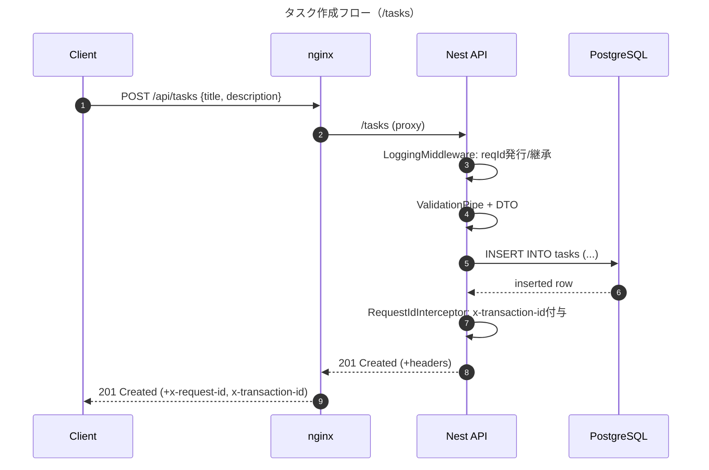
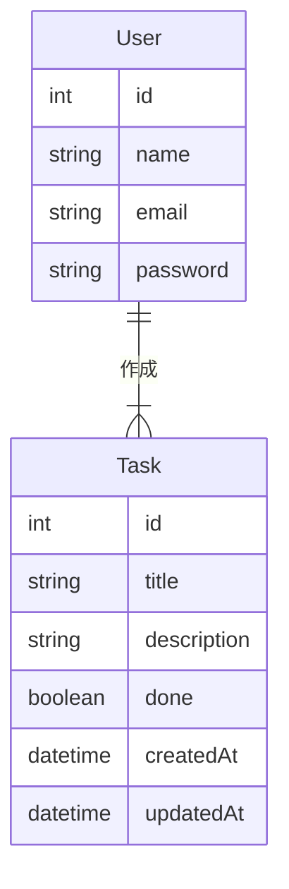
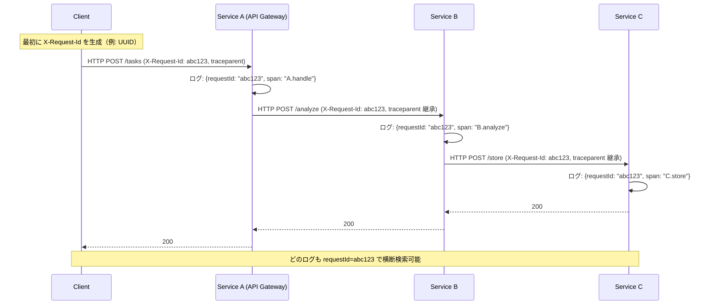

# ミニAPIサービスの設計・実装・運用チュートリアル
# 勉強すること
- APIサービス
  - シーケンス図
  - APIのI/O
  - Swaggerを使った自動生成
- 運用
  - ログ・トランザクションIDの作成・管理
  - nginx(API公開のためのゲートウェイ・リバースプロキシ)
  - dockerのhealthcheck
- データベース
  - TypeORM
  - PostgreSQL

# 作成物

# 1. docker作り
## 1.1 docker-compose.yml
- 作成物: ```docker-compose.yml```
- コンテナ間の関係性を中心に記述していく

## 1.2 nginx (エンジンエックス)
### nginxとは
- Webサーバのソフトウェア
- 主な用途
  - Webサーバ(静的ファイルの配信)
  - リバースプロキシ(ユーザからのリクエストを裏で動くアプリ(Node.jsとかFastAPIとか)に渡す)
  - ロードバランサ(複数のアプリにリクエストを分散させる)
  - SSL/TLS終端：HTTPS化を担う
- 外部ユーザからのアクセスをまず受け取るのが、このnginx

### 作り方
- 作成物 ```nginx/default.conf```
- 中身
  - ポート80で外部からのアクセスを受け付けます
  - /healthzにアクセスが来たら、単にokとだけ返す（ヘルスチェック）
  - /api/で始まるリクエストは、...に中継します
  - /docsで始まるリクエストは、...に中継します

# 2. APIサーバ
## 2.1 api/Dockerfile
- Node.js環境のdockerを作る
- 主要ステップは以下の通り
  1. depsステージ：   依存関係のインストール (package.json)
  2. buildステージ：  依存ライブラリと自分のソースコードを組み合わせたdistフォルダ(完成品)を作る
  3. runnerステージ： 「完成品」と依存関係だけを持ち込んで、軽量な実行専用環境を作る

## 2.2 APIの依存関係ライブラリのインストール
- 作成物: ```api/package.json``` & `api/tsconfig.json`
- 手打ちで作らない
- フォルダを作るところを含めて、このコマンドに任せる
  ```shell
  npx nest new (フォルダ名)
  # 質問にはnpmと回答
  ```
- 追加パッケージのインストール
  ```shell
  cd (フォルダ名)
  npm i @nestjs/swagger swagger-ui-express typeorm pg class-validator class-transformer
  ```
- 起動の確認
  ```shell
  npm run start:dev
  # ここで、devはpackage.jsonのscriptsのところに入っている
  # "start:dev": "nest start --watch",
  # に由来。 
  ```

## 2.3 Swaggerの環境整備
### そもそもSwaggerってなに？
- APIの仕様書をコードから自動で生成してくれるツール。
### Swagger UIの設定
- APIの情報をUIで確認可能。そのために一筆書く。
- 作成物: ```api/src/common/swagger.ts```

## 2.4 APIのログ管理ミドルウェアづくり
- NestJSのミドルウェア：リクエスト・レスポンスを傍受し、やりとりが走った際に処理をする仕組み。インターセプターより外側
- アプリに入ってくるリクエスト・レスポンスを傍受して、ログを残したり処理を追加したり。
- NestJSの「ミドルウェア」という仕組みを活用
- 作成物: `api/src/common/logging.middleware.ts`

## 2.5 IDを確認するインターセプターづくり
- インターセプター：APIのコントローラ・サービスなどの処理の合間に処理を割り込ませる
- リクエストにIDが含まれているかを確認し、あればレスポンスのヘッダ`x-transaction-id`として返す

## 2.6 アプリ全体の構成作り
- 作成物: `app.module.ts`
- 最初にDBの初期設定をすること、Middlewareを組み込むことを記載

## 2.7 アプリの入口作り
- 作成物: `src/main.ts`
- Interceptorを組み込むことなどを記載

## 2.8 TypeORMを用いたDBテーブル作り
### TypeORMとは
- ORM (Object Relational Mapping)
  - テーブルとプログラム内のObjectを対応させる仕組み
  - SQL文を直接書かなくても、オブジェクトを操作するだけでDBに内容を反映できる
- TypeORM
  - TypeScriptに対応したORM
  - 色々なDBで使える
## TypeORMを用いて、テーブルを定義する
- 作成物: `src/tasks/entities/task.entity.ts`
- ここではテーブルの設計図を書くイメージ
- クラス(エンティティクラス)を書きながら、クラスの中のオブジェクトがテーブルの何に相当するのかも記入できるようになっており、このクラスに基づくインスタンスを書き換えたうえで、特定のコマンド(repository.save()など)を走らせるとDBに反映できる

# 2.9 APIの入出力の型を指定
- 作成物: `src/tasks/dto/create-task.dto.ts`
- 作成物: `src/tasks/dto/get-tasks.dto.ts`

# 2.10 APIのserviceを書く
# 2.11 APIのcontrollerを書く
# 2.12 APIのmoduleを書く
# 2.13 TypeOrmのconfigを書く
- どの種類のテーブルを扱うのか
- どのテーブル(エンティティ)を扱うのか
- DBのユーザ名・PWなど

# 3. 追加実装
# 3.1 DELETE (this.repo.delete)
- 指定したIDのタスクを消す (serviceとcontrollerに書き足すだけ)
# 3.2 PATCH (this.repo.save)
- doneのboolean書き換え (serviceとcontrollerに書き足すだけ)
# 3.3 pgadminの追加
- docker-compose.ymlに書き足してbuildするだけ
- pgAdminへのログイン方法
  - email: docker-compose.ymlで指定したもの
  - password: docker-compose.ymlで指定したもの
  - ログイン後、Serversを右クリックして必要情報を入力。Host, Username, Passwordはdocker-compose.ymlのpostgresで指定したもの

# 4. OpenAPI
## 4.1 OpenAPIとは
- OpenAPI: APIの仕様書を標準化したフォーマット
  - コードから仕様書を作れる
  - 仕様書からコードの雛形を生成することも可能(詳細は自分で埋めていく)
- Swagger UIは、OpenAPI仕様をNestJSが吐き出したものを見せている
## 4.2 openapi.jsonを出力し、現状のAPI仕様を書きだす
- swagger.tsに出力コードを追記
- docker-compose.ymlにて、コンテナ内に出力したものをHost側にマウントすることも忘れずに。
## 4.3 openapi.jsonに追記
- 仕様を書きこむ
## 4.4 コードを生成
- javaを入れる
  ```shell
  winget install EclipseAdoptium.Temurin.17.JDK
  java --version
  ```
- 生成
  ```shell
  # クライアント（フロントで使える型安全SDK）
  npx @openapitools/openapi-generator-cli generate ^
    -i ./openapi/openapi.json ^
    -g typescript-axios ^
    -o ./gen-client

  # サーバ（NestJS のコントローラ雛形）
  npx @openapitools/openapi-generator-cli generate ^
    -i ./openapi/openapi.json ^
    -g typescript-nestjs ^
    -o ./gen-server
  ```
## 4.5 生成されたコードを参考に、自分でコードを書いていく
- 既存コードに追記してくれるわけではなく、コピペで完結するわけでもない。

# 5. E-R図
## 5.1 E-R図とは
- システムが管理する「もの」 (実体・Entity)とその「関係性」(Relationship)を図示するもの
- Entity
  - 管理したいもの
  - 例：ユーザ・タスク
- Attribute
  - Entityの中にAttribute(属性)がある
  - 例：タスクのタイトル・完了/未完了フラグ
- Relationship
  - Entity同士のつながり
  - 例：ユーザがタスクを作成する
## 書き方
1. 管理したいもの(Entity)の列記
2. Entityが持つ情報(Attribute)の整理
3. Entity間の関係性を整理
## 例


# 6. フロントエンドの追加（原文）
- `api-tutorial-ts`を参考に、タスクAPIをGUIから叩いて、結果を表示する
## 6.1 GUIの作成
- `npx create-react-app task-app --template typescript`でテンプレを作る
- `Dockerfile`を作成
  - ホットリロード対応版として、`Dockerfile.dev`を作成。
- docker-compose.ymlも書き換え
  - ホットリロード対応の場合、dockerfileのpathを書く必要あり。
## 6.2 GUIからAPIを叩く
- App.tsxに記載。ここでのAPIのエンドポイントの書き方には留意が必要。
## 6.3 めんどくさいところ
### 問題
- どのポートから触りに行くかで、うまく動く/動かないが違う
- 5173: frontendに直接触りに行く
- 3000: APIを直接触りに行く
- 80: nginxを経由して触りに行く【ここを必ず通るように統一すべき】
  - 同じコーディングでも、5173から操作するとAPIが叩けなかったりする
### 解決策
- 80からアクセスすることに統一する
- frontendからAPIを飛ばすときも、localhost...などは省略して、/api/tasks などと呼ぶようにする。

# 6. フロントエンドの追加（GPT加筆）

タスクAPIを**GUI（React）から呼んで結果を画面に出す**ところまで実装。  
**入口は Nginx の 80 番に一本化**して、フロントもAPIもそこで振り分ける形にしたのがポイント。

---

## 6.1 GUIの作成
- `npx create-react-app task-app --template typescript` で雛形を作成（※今回は CRA。Vite ではない）。
- Dockerfile を**2枚**用意するのがラク。
  - **開発用（ホットリロード）**: `Dockerfile.dev`  
    - `CMD ["npm", "start"]`（CRAの開発サーバ）
    - `ENV CHOKIDAR_USEPOLLING=true`（Docker上でも変更検知を安定させる）
    - `volumes: - ./task-app:/app` で**保存→即反映**
  - **本番用（静的配信）**: `npm run build` → `serve` や `nginx:alpine` で `build/` を配信  
    ※本番はホットリロードなし。確認用に使うときだけ。
- `docker-compose.yml` は **Nginx 経由に統一**するなら、**frontend サービスの `ports:` を外す**と迷いが減る（直アクセスの抜け道を塞ぐ）。

---

## 6.2 GUIからAPIを叩く
- **呼び先は相対パス**に統一するのが一番シンプル：  
  フロントからは `fetch('/api/tasks')` と書く。  
  Nginx が `/api` を API に中継してくれるので、**CORS 設定いらず**で動く。
- もし絶対URLを使いたい場合（今回は不要）：
  - CRA は `process.env.REACT_APP_*` 形式。`.env.development` に  
    `REACT_APP_API_BASE=http://localhost/api`  
    と書いて、`process.env.REACT_APP_API_BASE` を参照する。  
  - **.env を変えたら再起動必須**（ホットリロードでは拾わない）。

---

## 6.3 めんどくさいところ（原因と解決）

### 症状
- **ポートによって挙動が変わる**／同じコードでも API が叩けないことがある。
  - `5173` … **フロント直行**（Nginxを通らない）。`/api` もフロントに吸われて **HTML が返る** → `Unexpected token '<'`
  - `3000` … **API直行**（APIを外に公開している場合）。Nginxを通らないので CORS が絡みやすい。
  - `80` … **Nginx経由（推奨）**。`/` はフロント、`/api` はAPIに中継。Swagger もここから見られる。

### 解決
- **80 からアクセスに統一**（`http://localhost` を開く）。  
- フロントの `fetch` は **相対パス `/api/...`** を使う。  
- **frontend の `ports:` を外す**（＝ 5173/3000 でフロントに直行できないようにする）と事故が減る。
- `Unexpected token '<'` は「JSON と思って読んだら **HTML を受け取っていた**」サイン。  
  迷ったら `curl http://localhost/api/tasks` で Nginx 経由のレスポンスが **JSON** か確認。

---

## 6.4 Nginx 設定（方式A：/docs 統一・最小例）

```nginx
server {
  listen 80;
  server_name _;

  location /healthz {
    return 200 "ok";
    add_header Content-Type text/plain;
  }

  # フロント（React）
  location / {
    proxy_pass http://frontend:3000/;
    proxy_set_header Host $host;
    proxy_set_header Upgrade $http_upgrade;
    proxy_set_header Connection "upgrade";
  }

  # API（/api を剥がして中継 → /tasks などに届く）
  location /api/ {
    proxy_pass http://api:3000/;
    proxy_set_header Host $host;
    proxy_set_header X-Real-IP $remote_addr;
    proxy_set_header X-Forwarded-For $proxy_add_x_forwarded_for;
    proxy_set_header X-Forwarded-Proto $scheme;
  }

  # Swagger を /docs/ で公開（末尾 / に統一して相対パス崩れを防ぐ）
  location = /docs {
    return 301 /docs/;
  }
  location /docs/ {
    proxy_pass http://api:3000/api-docs/;
    proxy_set_header Host $host;
  }
}
```
- これで http://localhost がフロント、http://localhost/api/... がAPI、
http://localhost/docs/ が Swagger。

## 6.5運用メモ（小ネタ）

- ホットリロードは Dockerfile.dev + volumes でOK。保存すれば即反映。
- .env を変えたら再起動（CRA はホットで env を拾わない）。
- 動作確認の順番：
  1. `curl http://localhost/api/tasks` で JSON を確認
  2. `docker compose logs -f nginx api` を見ながらクリック → 両方にログが出ればルートOK
  3.  直アクセスの事故を避けたいなら、frontend の ports: を外す（Nginx 以外の入口を消す）。

---

# メモ
## 注入(Inject)ってなに？
- その場その場で処理を定義するのではなく、外部で定義した処理を持ってくること
- 注入する例：
  ```typescript
  @Injectable()
  export class CoffeeService {
    brew() {
      return "Coffee is ready!";
    }
  }

  @Injectable()
  export class AppService {
    constructor(private coffee: CoffeeService) {}  // ← ここで「注入」される
    getHello() {
      return this.coffee.brew();
    }
  }

  ```
- 注入を活用しない例：
  ```typescript
  class CoffeeService {
    brew() {
      return "Coffee is ready!";
    }
  }

  class AppService {
    private coffee: CoffeeService;

    constructor() {
      // 自分で依存するクラスを new している
      this.coffee = new CoffeeService();
    }

    getHello() {
      return this.coffee.brew();
    }
  }
  ```
## CORSってなに
- CORS: Cross-Origin Resource Sharing
  - ブラウザ上のJSが「他のオリジン」にあるデータを使えるかどうかを制御する仕組み
- CORSヘッダ（許可証）
  - サーバーが「どのオリジンからのリクエストを許可するか」をレスポンスで宣言する
  - 代表例: 
    - Access-Control-Allow-Origin
    - Access-Control-Allow-Methods
    - Access-Control-Allow-Headers
    - Access-Control-Allow-Credentials
- 技術的仕組み
  - オリジン: プロトコル + ドメイン + ポート番号が1セット。一つでも違えば別オリジン
  - preflightリクエスト(OPTIONS)
    - 特定の条件で「このオリジンから送っていいか」を事前確認
    - サーバーが `Access-Control-Allow-*` を返せば本リクエストが実行される

## NestJSの各ファイルの役割
- dto.ts:         APIの型定義
- module.ts:      全体像の定義。このモジュールには何があるか、を書いておく。
- controller.ts:  入出力関連。エンドポイントの定義もここ
- service.ts:     実際の処理
- (番外編) repository: DBとの通訳

## デコレータってなに
- @で始まるコード。そのすぐそばで定義されるオブジェクトに関して機能を付加したり情報を添付したりするためのもの。
- 例：
  ```ts
  @IsString()
  title!: string;
  // このtitleは文字列型じゃないとだめだよ
  ```

## バリデーションってなに
- APIのリクエストに入っているデータが指定された規則に従っているかを確認すること
- コーディング時ではなく、プログラムの実行時に確認する

## 複数サービスをまたぐデータに対して、どうIDを振るべきか
### 基本知識
- 一番初めにリクエストを受け取った部分(UIサービスなど)でIDを生成
- 生成したIDを後続の処理で必ず引数に含める
  - このIDを`X-Request-Id`と名付けることが慣例
- そのIDをログにも載せておく



### 関連知識
- IDをどう振るか
  - UUID v4がお勧め。
  - 時系列で並びやすいIDが良いならULIDというものも。
- クエリとヘッダ
  - クエリ：URLの末尾に「?」に続いて加えられる情報
  - ヘッダ：通信上のラベル・伝票。
    - curlなら「-H」オプションの後に続く情報
    - axiosなら「headers」というものを付ける
- ログを残す方法
  - Pino, Winstonなど。