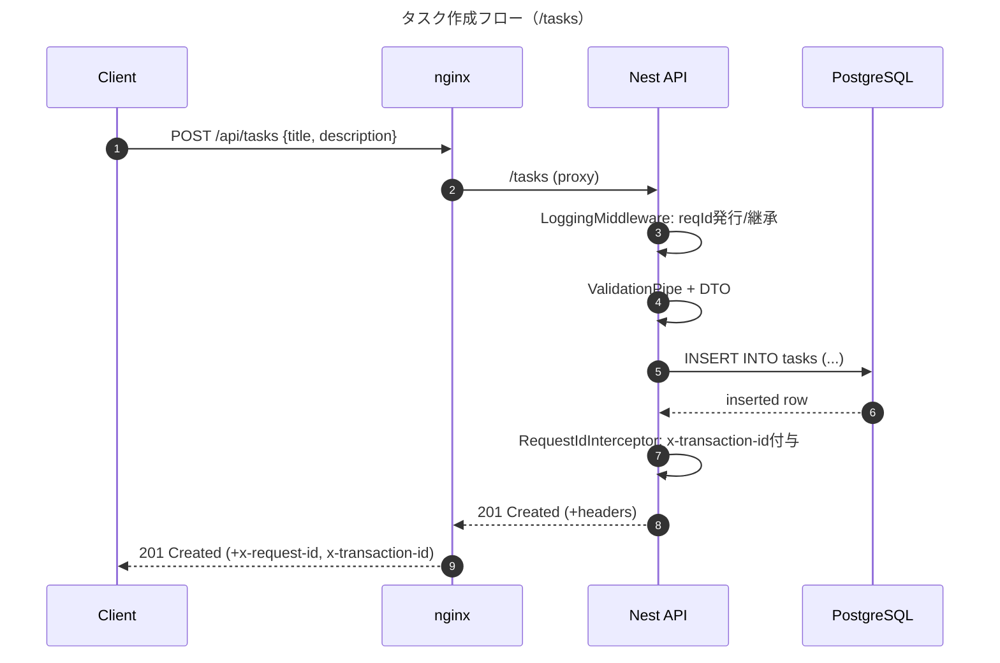

# ミニAPIサービスの設計・実装・運用チュートリアル
# 勉強すること
- APIサービス
  - シーケンス図
  - APIのI/O
  - Swaggerを使った自動生成
- 運用
  - ログ・トランザクションIDの作成・管理
  - nginx(API公開のためのゲートウェイ・リバースプロキシ)
  - dockerのhealthcheck
- データベース
  - TypeORM
  - PostgreSQL

# 作成物

# 1. docker作り
## 1.1 docker-compose.yml
- 作成物: ```docker-compose.yml```
- コンテナ間の関係性を中心に記述していく

## 1.2 nginx (エンジンエックス)
### nginxとは
- Webサーバのソフトウェア
- 主な用途
  - Webサーバ(静的ファイルの配信)
  - リバースプロキシ(ユーザからのリクエストを裏で動くアプリ(Node.jsとかFastAPIとか)に渡す)
  - ロードバランサ(複数のアプリにリクエストを分散させる)
  - SSL/TLS終端：HTTPS化を担う
- 外部ユーザからのアクセスをまず受け取るのが、このnginx

### 作り方
- 作成物 ```nginx/default.conf```
- 中身
  - ポート80で外部からのアクセスを受け付けます
  - /healthzにアクセスが来たら、単にokとだけ返す（ヘルスチェック）
  - /api/で始まるリクエストは、...に中継します
  - /docsで始まるリクエストは、...に中継します

# 2. APIサーバ
## 2.1 api/Dockerfile
- Node.js環境のdockerを作る
- 主要ステップは以下の通り
  1. depsステージ：   依存関係のインストール (package.json)
  2. buildステージ：  依存ライブラリと自分のソースコードを組み合わせたdistフォルダ(完成品)を作る
  3. runnerステージ： 「完成品」と依存関係だけを持ち込んで、軽量な実行専用環境を作る

## 2.2 APIの依存関係ライブラリのインストール
- 作成物: ```api/package.json``` & `api/tsconfig.json`
- 手打ちで作らない
- フォルダを作るところを含めて、このコマンドに任せる
  ```shell
  npx nest new (フォルダ名)
  # 質問にはnpmと回答
  ```
- 追加パッケージのインストール
  ```shell
  cd (フォルダ名)
  npm i @nestjs/swagger swagger-ui-express typeorm pg class-validator class-transformer
  ```
- 起動の確認
  ```shell
  npm run start:dev
  # ここで、devはpackage.jsonのscriptsのところに入っている
  # "start:dev": "nest start --watch",
  # に由来。 
  ```

## 2.3 Swaggerの環境整備
### そもそもSwaggerってなに？
- APIの仕様書をコードから自動で生成してくれるツール。
### Swagger UIの設定
- APIの情報をUIで確認可能。そのために一筆書く。
- 作成物: ```api/src/common/swagger.ts```

## 2.4 APIのログ管理ミドルウェアづくり
- NestJSのミドルウェア：リクエスト・レスポンスを傍受し、やりとりが走った際に処理をする仕組み。インターセプターより外側
- アプリに入ってくるリクエスト・レスポンスを傍受して、ログを残したり処理を追加したり。
- NestJSの「ミドルウェア」という仕組みを活用
- 作成物: `api/src/common/logging.middleware.ts`

## 2.5 IDを確認するインターセプターづくり
- インターセプター：APIのコントローラ・サービスなどの処理の合間に処理を割り込ませる
- リクエストにIDが含まれているかを確認し、あればレスポンスのヘッダ`x-transaction-id`として返す

## 2.6 アプリ全体の構成作り
- 作成物: `app.module.ts`
- 最初にDBの初期設定をすること、Middlewareを組み込むことを記載

## 2.7 アプリの入口作り
- 作成物: `src/main.ts`
- Interceptorを組み込むことなどを記載

## 2.8 TypeORMを用いたDBテーブル作り
### TypeORMとは
- ORM (Object Relational Mapping)
  - テーブルとプログラム内のObjectを対応させる仕組み
  - SQL文を直接書かなくても、オブジェクトを操作するだけでDBに内容を反映できる
- TypeORM
  - TypeScriptに対応したORM
  - 色々なDBで使える
## TypeORMを用いて、テーブルを定義する
- 作成物: `src/tasks/entities/task.entity.ts`
- ここではテーブルの設計図を書くイメージ
- クラス(エンティティクラス)を書きながら、クラスの中のオブジェクトがテーブルの何に相当するのかも記入できるようになっており、このクラスに基づくインスタンスを書き換えたうえで、特定のコマンド(repository.save()など)を走らせるとDBに反映できる

# 2.9 APIの入出力の型を指定
- 作成物: `src/tasks/dto/create-task.dto.ts`
- 作成物: `src/tasks/dto/get-tasks.dto.ts`

# 2.10 APIのserviceを書く
# 2.11 APIのcontrollerを書く
# 2.12 APIのmoduleを書く
# 2.13 TypeOrmのconfigを書く
- どの種類のテーブルを扱うのか
- どのテーブル(エンティティ)を扱うのか
- DBのユーザ名・PWなど

# 3. 追加実装
# 3.1 DELETE (this.repo.delete)
- 指定したIDのタスクを消す (serviceとcontrollerに書き足すだけ)
# 3.2 PATCH (this.repo.save)
- doneのboolean書き換え (serviceとcontrollerに書き足すだけ)
# 3.3 pgadminの追加
- docker-compose.ymlに書き足してbuildするだけ
- pgAdminへのログイン方法
  - email: docker-compose.ymlで指定したもの
  - password: docker-compose.ymlで指定したもの
  - ログイン後、Serversを右クリックして必要情報を入力。Host, Username, Passwordはdocker-compose.ymlのpostgresで指定したもの
# メモ
## 注入(Inject)ってなに？
- その場その場で処理を定義するのではなく、外部で定義した処理を持ってくること
- 注入する例：
  ```typescript
  @Injectable()
  export class CoffeeService {
    brew() {
      return "Coffee is ready!";
    }
  }

  @Injectable()
  export class AppService {
    constructor(private coffee: CoffeeService) {}  // ← ここで「注入」される
    getHello() {
      return this.coffee.brew();
    }
  }

  ```
- 注入を活用しない例：
  ```typescript
  class CoffeeService {
    brew() {
      return "Coffee is ready!";
    }
  }

  class AppService {
    private coffee: CoffeeService;

    constructor() {
      // 自分で依存するクラスを new している
      this.coffee = new CoffeeService();
    }

    getHello() {
      return this.coffee.brew();
    }
  }
  ```
## CORSってなに
- CORS: Cross-Origin Resource Sharing
  - ブラウザ上のJSが「他のオリジン」にあるデータを使えるかどうかを制御する仕組み
- CORSヘッダ（許可証）
  - サーバーが「どのオリジンからのリクエストを許可するか」をレスポンスで宣言する
  - 代表例: 
    - Access-Control-Allow-Origin
    - Access-Control-Allow-Methods
    - Access-Control-Allow-Headers
    - Access-Control-Allow-Credentials
- 技術的仕組み
  - オリジン: プロトコル + ドメイン + ポート番号が1セット。一つでも違えば別オリジン
  - preflightリクエスト(OPTIONS)
    - 特定の条件で「このオリジンから送っていいか」を事前確認
    - サーバーが `Access-Control-Allow-*` を返せば本リクエストが実行される

## NestJSの各ファイルの役割
- dto.ts:         APIの型定義
- module.ts:      全体像の定義。このモジュールには何があるか、を書いておく。
- controller.ts:  入出力関連。エンドポイントの定義もここ
- service.ts:     実際の処理
- (番外編) repository: DBとの通訳

## デコレータってなに
- @で始まるコード。そのすぐそばで定義されるオブジェクトに関して機能を付加したり情報を添付したりするためのもの。
- 例：
  ```ts
  @IsString()
  title!: string;
  // このtitleは文字列型じゃないとだめだよ
  ```

## バリデーションってなに
- APIのリクエストに入っているデータが指定された規則に従っているかを確認すること
- コーディング時ではなく、プログラムの実行時に確認する